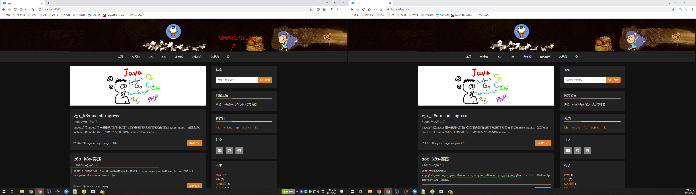

# icql-hexo

hexo主题仓库（修改定制原主题备份）

## docker部署
https://hub.docker.com/r/icql/hexo
``` bash
docker pull icql/hexo
docker run -it -p 4000:4000 -v /root/hexo:/hexo  --name hexo-test icql/hexo:0.2.4 /bin/bash
```

## [snippet](https://github.com/shenliyang/hexo-theme-snippet)
* 原主题作者：shenliyang
* 原主题仓库：https://github.com/shenliyang/hexo-theme-snippet
* 修改内容：
    * 1、增加全局深色/浅色模式切换
    * 2、增加备案主体相关信息配置
    * 3、修复文章预览出现123456789等一串数字（去除预览代码块相关内容）
    * 4、修复文章目录定位跳动
    * 5、调整其他样式
* 主题预览：    
 